# **Compresión**

Cuando la base de una columna resiste únicamente carga axial de compresión, el pedestal debe ser lo suficientemente grande para soportar las fuerzas transferidas desde la placa base, considerando el límite de carga del hormigón. Además, la placa base debe tener un espesor adecuado para cumplir con el límite de fluencia.

## **Estado de carga**

Para este estado de carga, la aplicación verificará tanto el aplastamiento del hormigón como el espesor de la placa base.

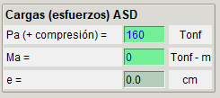

## **Verificación del aplastamiento del hormigón**

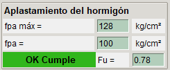

La tensión de soporte máxima del hormigón armado para el diseño de tensión admisible (ASD) está dada por:

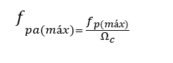

La tensión en la placa base provocada por el estado de carga está dada por la carga axial dividida por el área de la placa:

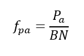

## **Verificación del espesor de la placa base**

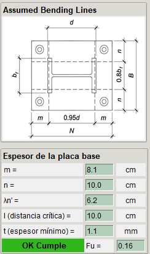

La presión de apoyo provoca la flexión de la placa base en secciones críticas, dependiendo del tipo de columna. (En la imagen superior se muestran las secciones y distancias críticas para una columna tipo W-Shapes). Para calcular el espesor mínimo requerido, se deben determinar estas distancias críticas.

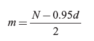

donde:

N = largo de la placa

d = largo de la columna

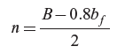

donde:

B = ancho de la placa

bf = ancho de la columna

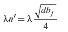

donde:

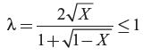

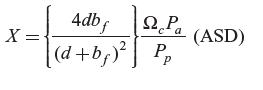

Finalmente el espesor mínimo se calcula con la siguiente fórmula:

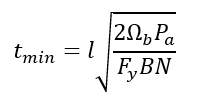

donde:

_l_ es el valor máximo entre las distancias críticas m, n y λn'

