# Section 3.1 Concentric Compressive Axial Loads

Cuando la base de una columna resiste sólo cargas axiales de compresión
de la columna, el pedestal debe ser lo suficientemente grande para
resistir las fuerzas de soporte transferidas desde la placa base (límite de
carga del hormigón) y la placa base debe tener un espesor suficiente
(límite de fluencia).

## Estado de carga
Para este estado de carga la aplicación verificará el aplastamiento del hormigón y el espesor de la placa base

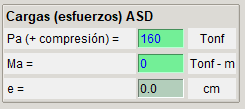

## Verificación del aplastamiento del hormigón

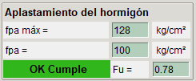

La tensión de soporte máximo del hormigon armado para el diseño de tensión admisible (ASD) está dado por:

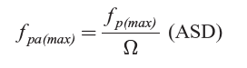

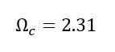

La tensión en placa provocada por el estado de carga está dado por la carga axial dividida por el área de la placa:

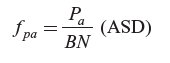

## Verificación del espesor de la placa base

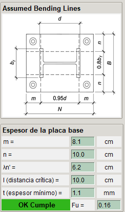

La presión de apoyo provoca la flexión de la placa base en secciones críticas, dependiendo del tipo de columna (En la imagen superior se muestran las secciones y distancias críticas para una columna tipo W-Shapes), para calcular el espesor mínimo requerido se deben calcular estas distancias críticas.

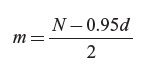

donde:

N = largo de la placa

d = largo de la columna

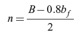

donde:

B = ancho de la placa

bf = ancho de la columna

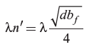

donde:

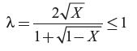

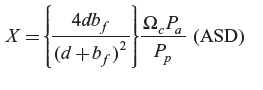

Finalmente el espesor mínimo se calcula con la siguiente fórmula:

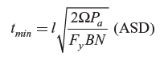

donde:

_l_ es el valor máximo entre las distancias críticas m,n y λn'

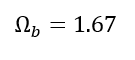

