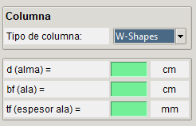

# Datos Iniciales

Para iniciar la aplicación se solicitan el ingreso de datos mínimos para desarrollar los cálculos y las verificaciones

## Materiales

Los materiales requeridos son la tensión de fluencia y tensión última del acero utilizado en las placas y en los pernos, y la del hormigón del pedestal.

## Columna

El tipo de columna indicará el criterio para las lineas de flexión en la placa base. Y las dimensiones requeridas dependerán del tipo de columna.

