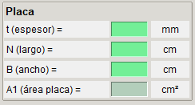
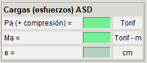

# Datos Iniciales

Para iniciar la aplicación se solicitan el ingreso de datos mínimos (casillas en verde) para desarrollar los cálculos y las verificaciones.

## Materiales

Los materiales requeridos son la tensión de fluencia y tensión última del acero utilizado en las placas y en los pernos, y la del hormigón del pedestal.

## Columna

El tipo de columna indicará el criterio para las lineas de flexión en la placa base. Y las dimensiones requeridas dependerán del tipo de columna.

## Placa

Adicional a la calidad del material de la placa ya ingresada se requieren tambien su geometría de espesor, largo y ancho.

## Pedestal

Adicional a la calidad del material del pedestal de hormigón ya ingresada se requieren tambien su geometría de largo y ancho.

## Pernos

Adicional a la calidad del material de los pernos, se requiere ingresar la cantidad de pernos en la linea de pernos, la distancia del centro del perno al borde de la placa y su diametro.

!!! warning
    - En todo el programa se considera una sola línea de pernos. El número de pernos se refiere exclusivamente a los pernos en esa única línea.

## Cargas (Esfuerzos)

Finalmente se necesita indicar la carga axial y de momento resultante del proceso de cálculo.

!!! warning
    - Carga axial positiva para compresión.

## Omegas (ASD)

Los factores de reducción Ω (Omega) inicialmente son los indicados en la Design Guide 01, edición 2.

