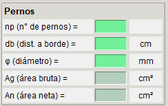

# **Datos Iniciales**

Para iniciar la aplicación, primero se solicitan el ingreso de datos mínimos (casillas en verde) para desarrollar los cálculos y las respectivas verificaciones.

## **Materiales**

Para los materiales (hormigón del pedestal, acero de placa y pernos), se requieren las propiedades mecánicas del fc' del hormigón del pedestal, así como las tensiones de fluencia y última de los aceros tanto para las placas como para los pernos de anclaje.

## **Columna**

Se consideran los tres tipos de columnas indicadas en la Design Guide (W-Shapes, HSS Rectangular y Pipe). El tipo de columna definida indicará los criterios para calcular las líneas (largos) de flexión en la placa base.

Dependiendo de la columna seleccionada, el programa desplegará los datos necesarios para desarrollar los cálculos.

## **Placa Base**

Se debe ingresar la geometría de la placa base, espesor, largo y ancho.

## **Pedestal de Hormigón**

Se debe ingresar la geometría del pedestal de hormigón, largo y ancho.

!!! ojo

    - La placa base podría estar sobre una losa de hormigón en lugar de un pedestal. En esos casos, se debe considerar un largo y ancho a criterio del ingeniero, teniendo presente si la placa base está cercana al borde de la losa.

## **Pernos de Anclaje**

Se debe ingresar la cantidad de pernos indicada en la línea de pernos, la distancia del centro del perno al borde de la placa y su diámetro.

!!! warning
    - En todo el programa se considera una sola línea de pernos. El número de pernos se refiere exclusivamente a los pernos en esa única línea.

Por ejemplo en la figura siguiente se deben ingresar:

- np (n° de pernos) = 4

## **Cargas (Esfuerzos)**

El ingeniero debe obtener los esfuerzos en combinaciones ASD y considerar los más desfavorables para realizar su análisis.

Por ejemplo:

- Máxima compresión con su respectivo momento.
- Máxima tracción con su respectivo momento.
- Máximo momento con su fuerza axial correspondiente.
- Cualquier otra combinación de máximos que se puedan obtener del análisis.

!!! warning
    - Carga axial positiva para compresión.

## **Factores de Reducción**

Se deben ingresar los factores de reducción Ω (Omega), ya que el desarrollo se realiza en ASD.

Inicialmente, los valores predeterminados son los indicados en la Design Guide 01, edición 2. Sin embargo, estos valores pueden editarse a criterio del ingeniero

