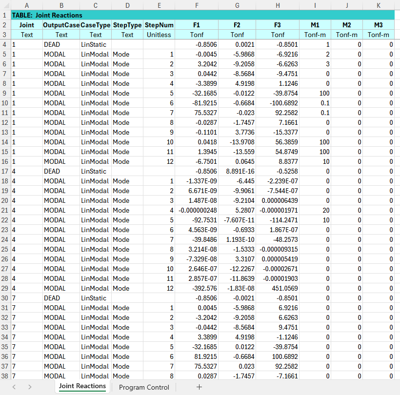
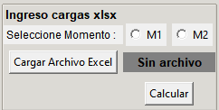
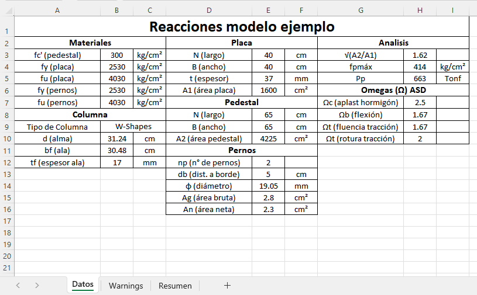
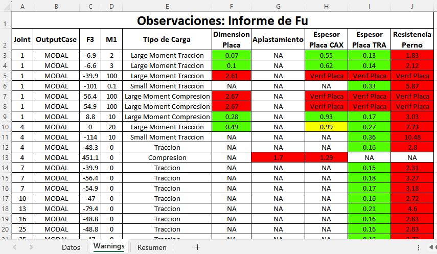
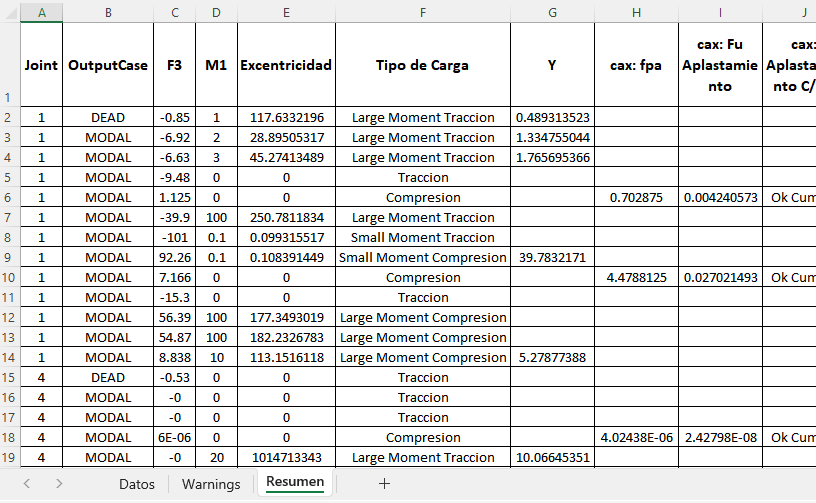

# **Ingreso Masivo de datos con XLSX**

## Proceso de ingreso de datos

Para ingresar varios estados de carga, se puede preparar un archivo de Excel similar al que se muestra en la figura. Este archivo debe incluir una pestaña denominada "Joint Reactions" para el ingreso de los datos correspondientes. Este formato es el que genera el software SAP al solicitar las reacciones en los nudos.

Antes de cargar el archivo de Excel, se debe seleccionar el momento (M1 o M2) que el programa utilizará para realizar la verificación.

## Proceso de salida de datos

Al presionar "Calcular", el software genera un archivo Excel con el resumen del proceso. Este archivo se guarda en la misma carpeta que el archivo de ingreso y toma el mismo nombre, añadiendo "_output" al final del nombre.

El archivo de salida se divide en tres pestañas:

- Datos: Contiene toda la información relacionada con los datos iniciales del anclaje.

- Warnings: Muestra las advertencias sobre los estados de carga que no cumplen alguna verificación.

- Resumen: Presenta un resumen de los valores calculados para la verificación, según el estado de carga correspondiente.

