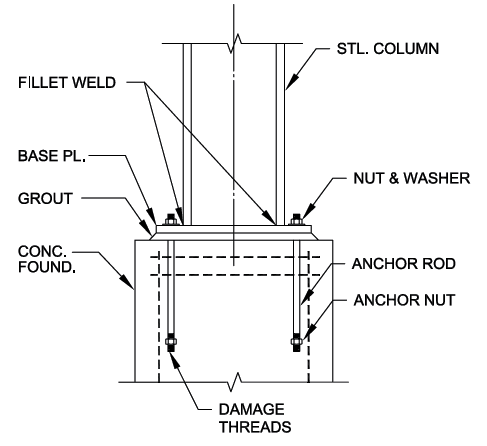

# **ANCLAJES**

# **Introducción**

## **Descripción general**

**anclajes** es una herramienta de escritorio intuitiva diseñada principalmente para ingenieros del área industrial. Esta aplicación facilita la gestión de tareas relacionadas con la verificación de las dimensiones y la resistencia de los elementos en la conexión típica de placas base de columnas en edificios y/o equipos.

La aplicación ofrece una interfaz gráfica de usuario (GUI) amigable que permite a los usuarios agregar, editar, eliminar y guardar tareas de manera eficiente, además de realizar cálculos y verificaciones estructurales. Entre sus funciones adicionales se incluyen recordatorios y categorización de tareas.

**anclajes** está basada en las directrices de la sección 3.0 (_Design of column base plate connections_) del **Design Guide 01**, asegurando que los cálculos y verificaciones sean precisos y cumplan con los requerimientos.

Los cálculos de **anclajes** se desarrollan siguiendo el diseño de tensión admisible (ASD), por lo cual las cargas ingresadas deben estar en combinaciones ASD.

*Figura 1: Conexión típica de base de columna.*
