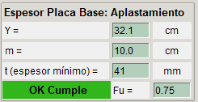
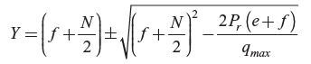
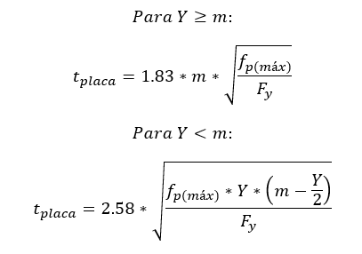
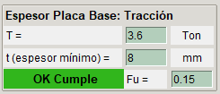
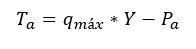
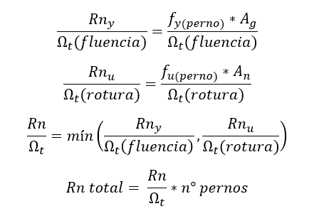

# **Momento Grande con Tracción**

Cuando la base de una columna resiste cargas axiales de tracción y momento, se debe analizar si es un momento pequeño o grande, cuando el momento es grande se debe verificar la condición de placa mínima, el espesor de placa y la resistencia de los pernos.
## **Estado de carga**

## **Categorización de Momento**

Cuando la excentricidad es mayor a la distancia f entonces es un Momento Grande.

## **Modelo Momento Grande con Tracción**

## **Verificación de dimensión mínima de la placa base**

Primero se debe verificar si la dimensión de la placa puede geometricamente recibir las cargas solicitadas

## **Espesor de la placa base por Aplastamiento**

donde m es la distancia crítica de bending lines

## **Espesor de la placa base por Tracción**

## **Resistencia pernos**

