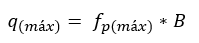
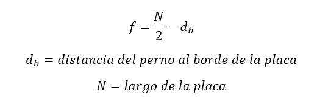

# Section 3.4 Design of Column Base Plates with Large Moments

Cuando la base de una columna resiste cargas axiales y momento, se debe analizar si es un momento pequeño o grande, esto se realiza con la excentricidad crítica, cuando el momento es grande se debe verificar la condición de placa mínima, el espesor de placa y se calcula el número de pernos necesarios para soportar las tracciones.

## Categorización de Momento

La fuerza resultante máxima se obtiene de:

donde:

B = ancho de la placa

La excentricidad crítica se obtiene de:

donde:

N = largo de la placa

Pr = Pa (+ compresión)

## Modelo Large Moment

## Verificación de dimensión mínima de la placa base

Primero se debe verificar si la dimensión de la placa puede geometricamente recibir las cargas solicitadas

## Espesor de la placa base por Aplastamiento

donde m es la distancia crítica de bending lines

## Espesor de la placa base por Tracción

