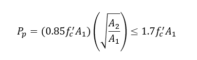

# Resultados Iniciales

## Placa

Con el largo y ancho se cálculan el área de trabajo de la placa.

## Pedestal

Con el largo y ancho se cálculan el área de trabajo máximo del pedestal.

## Pernos

Con el diámetro del perno se cálculan su área bruta y neta

## Soporte y esfuerzos

Se calcula la resistencia nominal de soporte (Pp) y la tensión de soporte máximo del hormigón fp(max), que dependen de un factor de forma que involucra a el área del pedestal (A2) y el área de la placa (A1).

_Resitencia Nominal de soporte de hormigón armado:_

_Tensión de Soporte Máximo de hormigón armado y factor de áreas:_

Además con el ingreso de los esfuerzos carga axial y de momento resultante del proceso de cálculo, se calcula la excentricidad provocada por estos.

