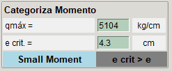
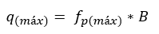
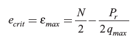
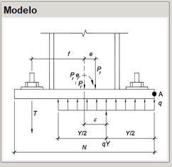
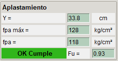
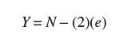
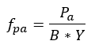
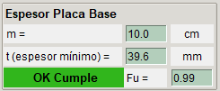
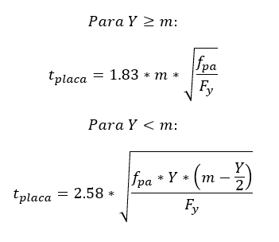

# Momento Pequeño con Compresión

Cuando la base de una columna resiste cargas axiales de compresión y momento, se debe analizar si es un momento pequeño o grande, esto se realiza con la excentricidad crítica, cuando el momento es pequeño la fuerza axial es resistida por aplastamiento y no hay tendencia a volcarse, no requiriendo pernos para la tracción.

## Categorización de Momento

La fuerza resultante máxima se obtiene de:

donde:

B = ancho de la placa

La excentricidad crítica se obtiene de:

donde:

N = largo de la placa

Pr = Pa (+ compresión)

## Modelo Momento Pequeño con Compresión Axial

## Verificación aplastamiento

El largo del aplastamiento es:

donde:

N = largo de la placa

e = excentricidad por estado de carga

La tensión en placa entonces es:

## Verificación del espesor de la placa base

donde m es la distancia crítica de bending lines

