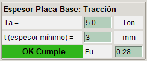
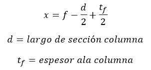

# **Momento Pequeño con Tracción**

Cuando la base de una columna resiste cargas axiales de tracción y momento, se debe analizar si el momento es pequeño o grande. Cuando el momento es pequeño, se debe verificar el espesor de la placa base y la resistencia de los pernos.

## **Estado de carga**

## **Categorización de Momento**

Cuando la excentricidad es menor a la distancia f entonces es un Momento Pequeño.

## **Modelo Momento Pequeño con Tracción**

## **Espesor de la placa base por Tracción**

## **Resistencia pernos**

### **Cálculo de Resistencia**

### **Cálculo de Solicitación**

