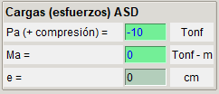
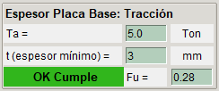
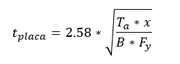
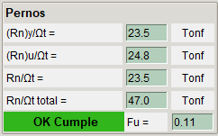
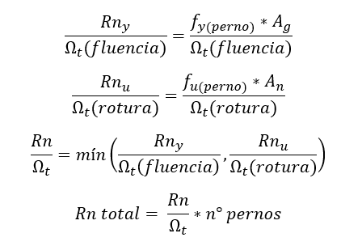

# **Tracción**

Cuando la base de una columna resiste sólo carga axial de tracción, la placa base debe tener un espesor suficiente (límite de fluencia) y se debe verificar la resistencia de los pernos para la tracción solicitada.

## **Estado de carga**
Para este estado de carga la aplicación verificará el espesor de la placa base y la resistencia de los pernos.

## **Espesor de la placa base por Tracción**

## **Resistencia pernos**

