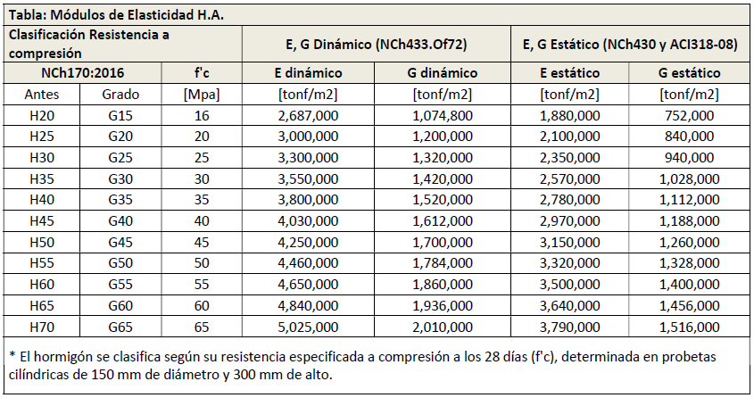
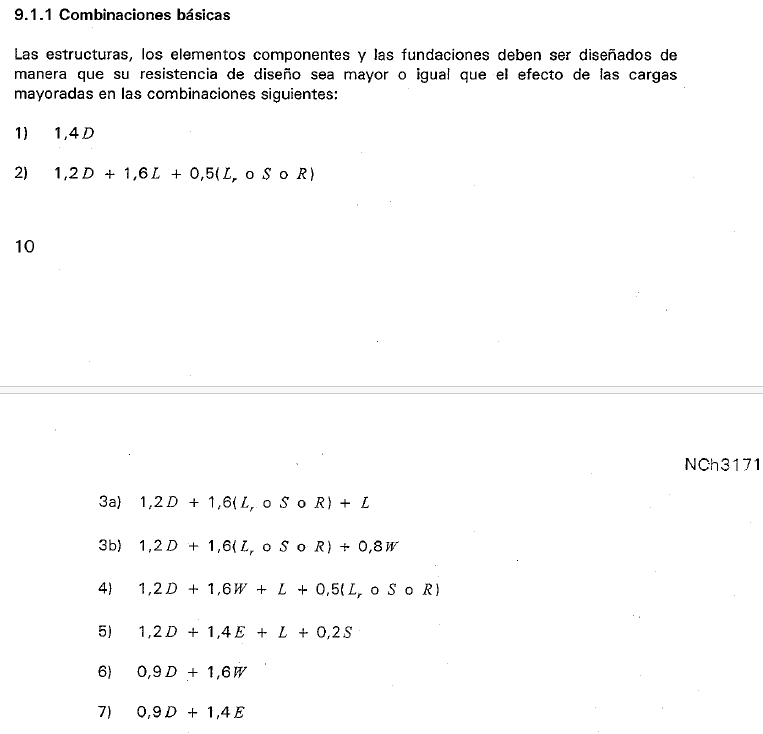

# Configuración

## Inicio

<p style="text-align: justify;">
  La aplicación requiere de un archivo de configuración para el proyecto, de manera de poder transmitir a Etabs las distintas opciones disponibles para cada parámetro requerido.<br>
</p>

<p style="text-align: justify;">
Se debe crear un archivo en el directorio de trabajo <strong><em>project_settings.toml</em></strong>.
</p>

!!! warning

    Se debe respetar totalmente el nombre de los parámetros (mayúsculas, minúsculas, guiones, comillas, etc, mostrado en los ejemplos).

!!! tip

    Si estás usando vscode puedes instalar la extensión **Even Better TOML** para que tu archivo de configuración tenga resaltado de sintaxis.

```toml
[Version_etabs]
  version = "v21"

[Project_Information]
  Client_Name = "MGV Ingeniería"
  Project_Name = "Proyecto de Prueba"
  Project_Number = "R9999"
  Company_Name = "IEC Ingenieria SA"
  Engineer = "MGV"
  Checker = "LRM"
  Supervisor = "MGB"
  Model_Name = "R9999"
  Model_Description = "Este es un edificio de pruebas de dxftoedb"

[Data]
  Diaphragms      = ["D1"]
  Modulo_Dinamico = true
  Categoria = "II"
  Zona      = 2
  Suelo     = "B"

[Materials]
  Concrete = ["G30", "G40"]
  Steel    = []
  Rebar    = ["A630-420H"]

[Stories]
  BaseElevation = -1.5
  Data = [
    ["p01", 2.5, "01", "G30"],
    ["p02", 2.5, "02", "G30"]
  ]

[Load_Patterns]
  D   =  true  # Carga Permanente
  Di  = false  # Peso del Hielo
  CM  =  true  # Carga Permanente Adicional
  L   =  true  # Carga de uso según NCh 1537
  Lr  = false  # Carga de uso de techo según NCh 1537
  S   = false  # Carga de nieve según NCh 431
  R   = false  # Carga de lluvia según ASCE/SEI 07, capítulo 8
  Wxp = false  # Carga de viento según NCh 432, en dirección X+
  Wxn = false  # Carga de viento según NCh 432, en dirección X-
  Wyp = false  # Carga de viento según NCh 432, en dirección Y+
  Wyn = false  # Carga de viento según NCh 432, en dirección Y-
  TAX =  true  # Torsión Accidental para sismo X
  TAY =  true  # Torsión Accidental para sismo Y

[cargas]
  estacionamiento = [0.10, 0.50]
  habitacion      = [0.15, 0.20]
  pasillo         = [0.15, 0.40]

[Modal_Case]
  ModalCaseName = "modal"
  EigenOrRitz   = "Eigen"
  MinModes      = 36
  MaxModes      = 36

[Load_Combinations]
  LRFD        = true
  ASD         = false
  fundaciones = true

```

## Secciones project_settings

### Version_etabs

La aplicación funciona para dos versiones de Etabs, 19 y 21

```toml
[Version_etabs]
  version = "v21"
```

### Project_Information

En esta sección se configuran los metadatos del proyecto.
Los campos que se deben configurar son los mostrados a continuación:

```toml
[Project_Information]
  Client_Name = "MGV Ingeniería"
  Project_Name = "Proyecto de Prueba"
  Project_Number = "R9999"
  Company_Name = "IEC Ingenieria SA"
  Engineer = "MGV"
  Checker = "LRM"
  Supervisor = "MGB"
  Model_Name = "R9999"
  Model_Description = "Este es un edificio de pruebas de dxftoedb"
```

<p align="center">
  
</p>

### Data

En esta sección se configuran parámetros generales del proyecto.

```toml
[Data]
  Diaphragms      = ["D1"]
  Modulo_Dinamico = true
  Categoria       = "II"
  Zona            = 3
  Suelo           = "D"
```

#### Varios diafragmas

```toml
[Data]
  Diaphragms      = ["D1", "D2", "D3"]
```

#### Módulo de elasticidad dinámico

```toml
[Data]
  Modulo_Dinamico = true
```

#### Módulo de elasticidad estático

```toml
[Data]
  Modulo_Dinamico = false
```

#### Categorías

Se admiten las categorías "I", "II", "III" y "IV" para la generación automática del espectro de respuesta elástico de la norma NCh433.

#### Zonas

Se admiten las zonas 1, 2 y 3 para la generación automática del espectro de respuesta elástico de la norma NCh433.

#### Suelos

Se admiten las suelos "A", "B", "C", "D" y "E" para la generación automática del espectro de respuesta elástico de la norma NCh433.

Si se indica suelo F, el espectro de respuesta elástico se debe configurar directamente en ETABS.

### Materials

En esta sección se configura lo relacionado con los materiales.

```toml
[Materials]
  Concrete = ["G30", "G40"]
  Rebar    = ["A630-420H"]
  Steel    = []
```

#### Concrete

Es posible definir todos los tipos de hormigones necesarios para el proyecto de entre los de la siguiente imagen, tanto en la nomenclatura "GXX" como "HXX". Se considera una densidad para todos los hormigones de 2.5 ton/m3.

<p align="center">
  
</p>

#### Rebar

Es posible definir todos los tipos de calidad de acero de refuerzo necesarios para el proyecto de entre "A630-420H" y "A440-280H". Se considera una densidad para todos los aceros de 7.85 ton/m3.

#### Steel

EN DESARROLLO ...

### Stories

En esta sección se proporciona la información necesaria para definir los pisos de la estructura.

```toml
[Stories]
  BaseElevation = -1.5
  Data = [
    ["p01", 2.5, "01", "G30"],
    ["p02", 2.5, "02", "G30"]
  ]
```

<div>
  <ul>
    <li>El parámetro 'BaseElevation' representa la cota de empotramiento de la estructura.</li>
    <li> El parámetro 'Data' corresponde a una lista de listas, donde cada una de las listas representa la información requerida de cada piso. Para cada piso se necesitan 4 datos.
      <ol>
        <li>Nombre que llevará el piso en Etabs.</li>
        <li>Altura entre piso.</li>
        <li>Nombre del plano dxf del que se rescata la información respectiva.</li>
        <li>Tipo de hormigón de la losa en la nomenclatura "GXX"</li>
      </ol>
    </li>
  </ul>
</div>

### Load_Patterns

En esta sección se definen los Load Patterns (Patrones de carga) que llegarán a Etabs.
El valor 'true' significa que se creará ese patrón de carga en Etabs, 'false' lo contrario.

- Los patrones de carga D, Di, CM, L, Lr, S, R, Wxp, Wxn, Wyp, Wyn, TAX y Tay, son los patrones de carga por defecto, no es necesario que estén presentes, pero para que sea posible generar las combinaciones de carga de manera automática es necesario que se llamen exactamente de esta manera. Se recomienda no eliminar estos estados de carga por defecto, sino que simplemente cambiar al valor 'false' en caso que el estado de carga respectivo no esté presente.

- Está permitido agregar estados de carga adicionales después de los estados de carga por defecto, estos estados de carga se agregarán de manera automática en Etabs y **siempre serán de tipo Dead**, pero será **responsabilidad del usuario** incorporarlos en las combinaciones de carga.

- Se ha intentado homologar el nombre de los patrones de carga a los que aparecen en la norma NCh3171.

- Se ha incorporado un estado de carga no normativo "CM", ya que es una práctica común desacoplar el peso propio de las cargas muertas adicionales.

- La nomenclatura Wxp, Wxn, Wyp y Wyn se traduce como viento en dirección X positivo, dirección X negativo, dirección Y positivo y dirección Y negativo.

```toml
[Load_Patterns]
  D   =  true  # Carga Permanente
  Di  = false  # Peso del Hielo
  CM  =  true  # Carga Permanente Adicional
  L   =  true  # Carga de uso según NCh 1537
  Lr  = false  # Carga de uso de techo según NCh 1537
  S   = false  # Carga de nieve según NCh 431
  R   = false  # Carga de lluvia según ASCE/SEI 07, capítulo 8
  Wxp = false  # Carga de viento según NCh 432, en dirección X+
  Wxn = false  # Carga de viento según NCh 432, en dirección X-
  Wyp = false  # Carga de viento según NCh 432, en dirección Y+
  Wyn = false  # Carga de viento según NCh 432, en dirección Y-
  TAX =  true  # Torsión Accidental para sismo X
  TAY =  true  # Torsión Accidental para sismo Y
```

### Cargas

En esta sección se configura el valor de las cargas estáticas en ton/m2 que se aplicarán sobre las losas de la estructura. Se debe agregar un valor por cada patrón de carga marcado como 'true' entre Di, CM, L, Lr, S, R.

Se debe asignar un nombre a cada carga, la cual se debe tener una correlación con un load pattern estático de la sección anterior.

```toml
[cargas]
  estacionamiento = [0.10, 0.50]
  habitacion      = [0.15, 0.20]
  pasillo         = [0.15, 0.40]
```

### Modal_Case

Esta sección es para definir las características del caso modal.

```toml
[Modal_Case]
  ModalCaseName = "modal"
  EigenOrRitz   = "Eigen"
  MinModes      = 36
  MaxModes      = 36
```

### Load_Combinations

Esta sección es para indicar que combinaciones de carga se desea generar automáticamente a partir de los patrones de carga existentes.

```toml
[Load_Combinations]
  LRFD        = true
  ASD         = false
  fundaciones = true
```

#### LRFD

Corresponde a las combinaciones utilizando el método de diseño por resistencia. Valor 'true' para generación automática. La imagen siguiente extraida de la norma NCh3171,muestra las combinaciones que se generan automaticamente.

<p align="center">
  
</p>

!!! warning

    No se considera la modificación a las ecuaciones de combinación de carga producto de las excepciones que la misma norma indica en este mismo punto 9.1.1.

#### ASD

Corresponde a las combinaciones utilizando el método de tensiones admisibles. Valor 'true' para generación automática. La imagen siguiente extraida de la norma NCh3171,muestra las combinaciones que se generan automaticamente.

<p align="center">
  
</p>

#### fundaciones

Corresponde a las combinaciones utilizando el método de tensiones admisibles para la generación de combinaciones no lineales basada en la metodología mediante la cual se representan las cargas sísmicas sobre las fundaciones a través de los modos más representativos. Valor 'true' para generación automática.

- Estas combinaciones no son las "definitivas", puesto que para obtener la versión final es necesario realizar un proceso para obtener los modos predominantes.
- Para las combinaciones de carga al sismo X siempre se aplicará el modo 1, mientras que para sismo Y siempre se aplicará el modo 2, esto DEBE ser editado por el usuario una vez realizado el análisis.
- El factor de amplificación aplicado a la forma modal se deja en un valor exagerado 999, esto DEBE ser editado por el usuario una vez realizado el análisis.

<p align="center">
  
</p>

### Entidades (opcional)

En esta parte del archivo de configuración se indican las capas (layers) existentes en los planos y que representan a los ejes, vigas, muros y columnas. Cada entidad está definida por un nombre.

```toml
[entidades]
  [entidades.LINEAS_DE_EJES]
    Layer = "S-GRID"

  [entidades.TEXTOS_DE_EJES]
    "Layer" = "S-GRID-IDEN"

  [entidades.LINEAS_DE_VIGAS]
    "Layer" = "S-BEAM"

  [entidades.TEXTOS_DE_VIGAS]
    "Layer" = "S-BEAM-IDEN"

  [entidades.LINEAS_DE_MUROS]
    "Layer" = "A-WALL"

  [entidades.TEXTOS_DE_MUROS]
    "Layer" = "A-WALL-IDEN"

  [entidades.LINEAS_DE_COLUMNAS]
    "Layer" = "COLUMNAS"

  [entidades.TEXTOS_DE_COLUMNAS]
    "Layer" = "TEXTOS"
```

!!! tip

    Tomar nota del nombre de los layers en la etapa anterior de preparación de planos.

En la imagen siguiente se pueden observar el nombre de las capas en BricsCad.

<p align="center">
  
</p>
