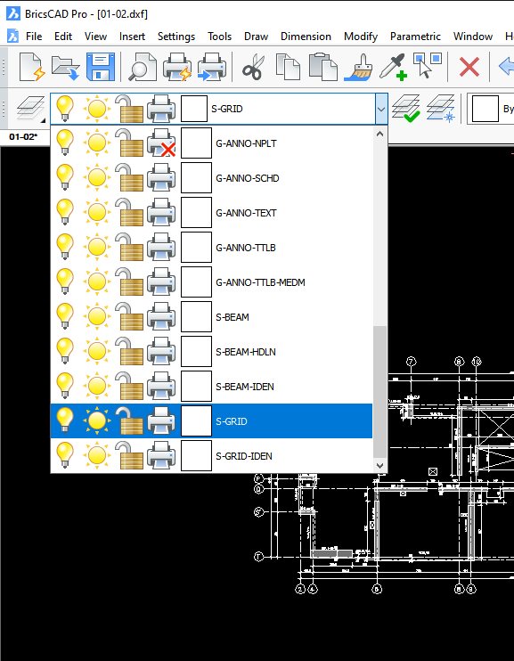

# Configuración

## Inicio

La aplicación permite la configuración de parámetros avanzados opcionales cuando se requiera un mayor control de la configuración en Etabs o mayor flexibilidad en los elementos presentes en los planos.

### Entidades

En los proyectos que han sido prepinchados siguiendo el procedimiento tradicional, los nombres de los layers han sido previamente asignados por quien los preparó. Puede haber escenarios donde no se ha realizado el prepinchado o se requiere mayor flexiblidad respecto de los layers.

En esta parte del archivo de configuración se indican las capas (layers) existentes en los planos y que representan a los ejes, vigas, muros y columnas. Cada entidad está definida por un nombre.

```toml
[entidades]
  [entidades.LINEAS_DE_EJES]
    Layer = "S-GRID"

  [entidades.TEXTOS_DE_EJES]
    "Layer" = "S-GRID-IDEN"

  [entidades.LINEAS_DE_VIGAS]
    "Layer" = "S-BEAM"

  [entidades.TEXTOS_DE_VIGAS]
    "Layer" = "S-BEAM-IDEN"

  [entidades.LINEAS_DE_MUROS]
    "Layer" = "A-WALL"

  [entidades.TEXTOS_DE_MUROS]
    "Layer" = "A-WALL-IDEN"

  [entidades.LINEAS_DE_COLUMNAS]
    "Layer" = "COLUMNAS"

  [entidades.TEXTOS_DE_COLUMNAS]
    "Layer" = "TEXTOS"
```

!!! tip

    Tomar nota del nombre de los layers en la etapa anterior de preparación de planos.

En la imagen siguiente se pueden observar el nombre de las capas en BricsCad.



### Concrete Frames Modifiers

Este parámetro controla los modificadores de rigidez de los elemenetos frame del modelo. El valor por defecto es <code>modificadores = [1, 1, 1, 0, 1, 1, 1, 1]</code>, con valor 0 para la rigidez de torsión.

```toml
[Concrete_Frame_Modifiers]
  modificadores = [1, 1, 1, 0, 1, 1, 1, 1]
```

### Wall Modifiers

Este parámetro controla los modificadores de rigidez de los elementos área del modelo. El valor por defecto es <code>modificadores = [1, 1, 1, 1, 1, 1, 1, 1]</code>.

```toml
[Wall_Modifiers]
  modificadores = [1, 1, 1, 1, 1, 1, 1, 1]
```

### Shell Thin Limit

Este parámetro indica el límite de espesor para que el elemento de área sea de tipo thin. Valores mayores generan elementos tipo thick. El valor por defecto es 0.4 metros.

```toml
[ShellThinLimit]
  espesor_limite = 0.4
```
