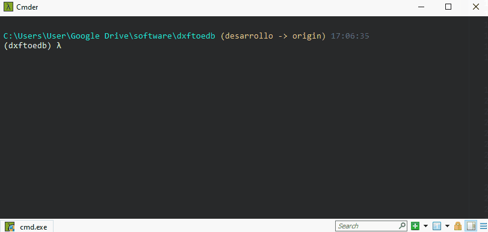
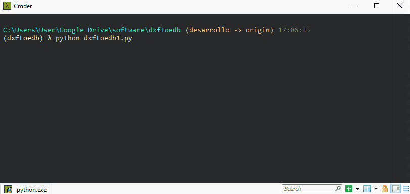

# Dxftoedb1

Dxftoedb1 es el primer script de la aplicación. Su función es leer los planos originales (después del 'pre-pinchado') y generar un nuevo set de planos 'limpios', solo con los elementos recuperados que pertenecen a las capas indicadas y en las nuevas capas, junto con un archivo excel con las coordenadas de los ejes que se logró recuperar.

## Input

1. Planos pre-pinchados en formato dxf.
2. Archivo de configuración project_settings.toml

## ¿Cómo ejecutar dxftoedb1?

Se debe ejecutar como cualquier script de python en la línea de comandos.

  

Luego de la ejecución se solicitará al usuario seleccionar la carpeta de trabajo. La carpeta de trabajo es donde están los planos preparados en dxf y el archivo de configuración project_settings.toml.

  

## Output

El resultado de la ejecución de dxftoedb1 es la generación de la carpeta "planos_dxftoedb" dentro del directorio de trabajo y del archivo excel "grilla_RXXXX.xlsx".

  <a href="../planos_grilla/" style="display: inline-block; background-color: #EF7701; color: white; padding: 5px 10px; text-decoration: none; border-radius: 5px;">Siguiente: Planos Grilla</a>

