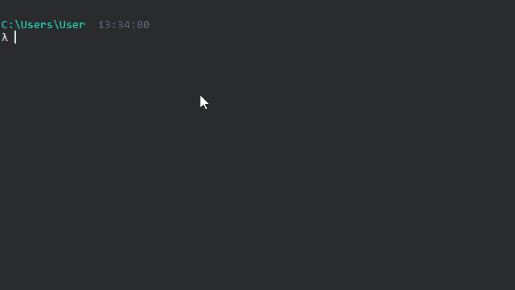

# Dxftoedb1

Dxftoedb1 es el primer script de la aplicación. Su función es leer los planos originales (después del 'pre-pinchado') y generar un nuevo set de planos 'limpios', solo con los elementos recuperados que pertenecen a las capas indicadas y en las nuevas capas, junto con un archivo excel con las coordenadas de los ejes que se logró recuperar.

## Input

1. Planos pre-pinchados en formato dxf.
2. Archivo de configuración project_settings.toml

## Uso

Se debe ejecutar invocando el comando <code>dxftoedb1</code>

Luego de la ejecución se solicitará al usuario seleccionar la carpeta de trabajo. La carpeta de trabajo es donde están los planos preparados en dxf y el archivo de configuración project_settings.toml.

## Output

El resultado de la ejecución de dxftoedb1 es la generación de la carpeta "planos_dxftoedb" con los planos \_grilla y del archivo excel "grilla_RXXXX.xlsx".
