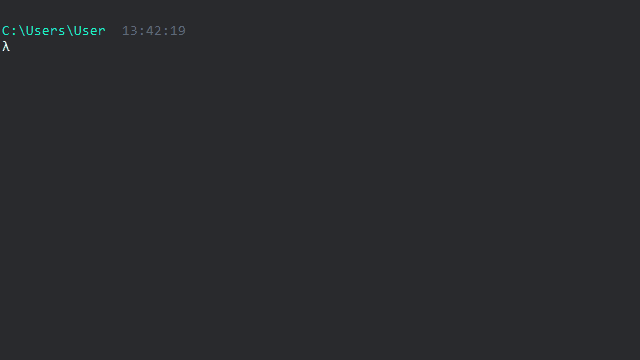
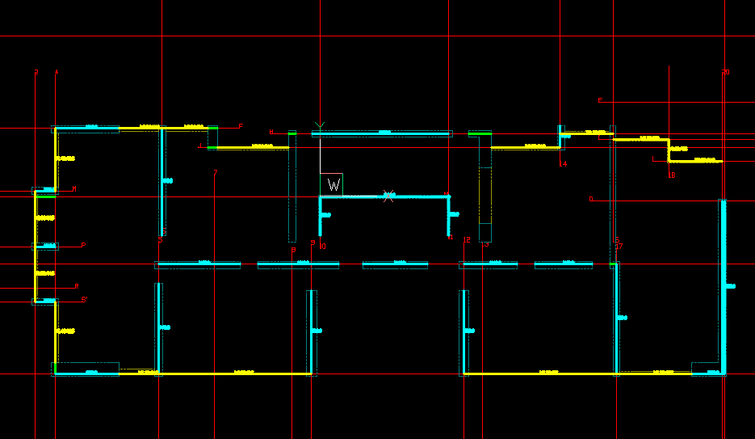
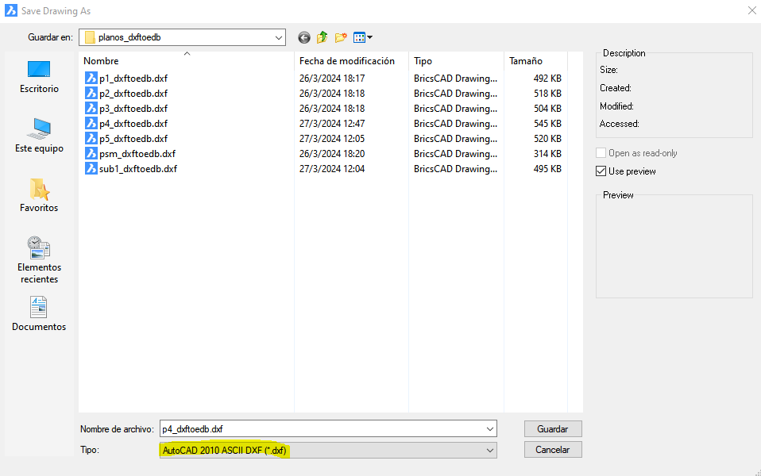
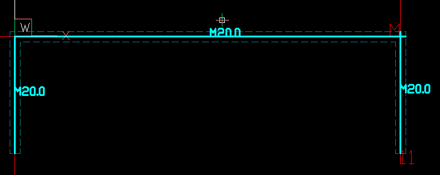
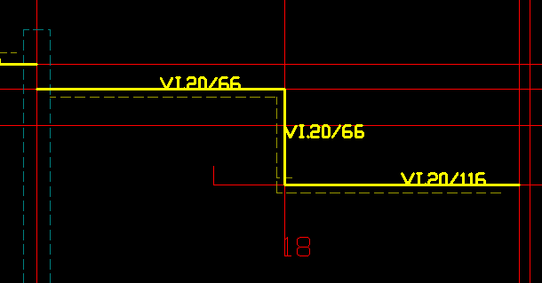

# Dxftoedb2

Dxftoedb2 es el segundo script de la aplicación. Su función es leer los planos generados del paso anterior para encontrar los elementos estructurales y representarlos mediante una línea característica que pasa por el eje de coordenadas correspondiente.

## Input

1. Planos "../planos_dxftoedb/[nombre_plano]\_grilla.dxf"
2. Archivo "../grilla_RXXXX.xlsx"

## Uso

Se debe ejecutar invocando el comando <code>dxftoedb2</code>

Luego de la ejecución se solicitará al usuario seleccionar la carpeta de trabajo. La carpeta de trabajo es donde está el archivo de configuración project_settings.toml.

## Output

El resultado de la ejecución de dxftoedb2 es la generación de los planos "../planos_dxftoedb/[nombre_plano]\_dxftoedb.dxf". Estos son planos de trabajo, en los que se debe ajustar los elementos estructurales.

!!! warning

    Al editar un plano, se debe guardar en formato **Autocad 2010 ASCI DXF (.dxf)**

    

### Elementos estructurales

Los elementos estructurales en el plano están representados por líneas y un texto representativo de la sección.

- El usuario debe ajustar el inicio y fin de las líneas para determinar las dimensiones de los elementos estructurales.

- El usuario debe ajustar el texto de la sección para representar adecuadamente la sección transversal. Para que sea correctamente reconocido debe cumplir con:
    - El texto debe tocar la línea que representa al elemento estructural
    - El punto de contacto debe estar en el tercio central de la línea

#### Muros

Los muros son líneas en la capa "MUROS_etabs" de color calipso.

#### Vigas

Las vigas son líneas en la capa "VIGAS_etabs" de color amarillo.

#### Columnas

EN DESARROLLO ...
