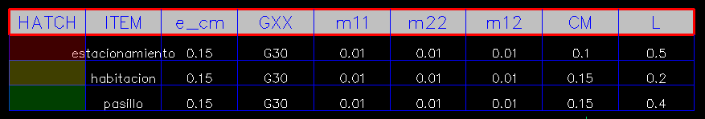

# Dxftoedb2

Dxftoedb2 es el segundo script de la aplicación. Su función es leer los planos generados del paso anterior para encontrar los elementos estructurales y representarlos mediante una línea caracteristica que pasa por el eje de coordenadas correspondiente. En esta etapa también se genera la tabla de p propiedades y cargas de las losas.

## Input

1. Planos "../planos_dxftoedb/[nombre_plano]\_grilla.dxf"
2. Archivo "../grilla_RXXXX.xlsx"

## Uso

Se debe ejecutar invocando el comando <code>dxftoedb2</code>

  

## Output

El resultado de la ejecución de dxftoedb2 es la generación de los planos "../planos_dxftoedb/[nombre_plano]\_dxftoedb.dxf". Estos son planos de trabajo, en los que se debe ajustar los elementos estrucurales y cargas que finalmente llegarán al modelo Etabs.

  

### Elementos estructurales

Los elementos estructurales en el plano están representado por líneas y un texto representativo de la sección.

- El usuario debe ajustar el inicio y fin de las líneas para determinar las dimensiones de los elementos estructurales.

- El usuario debe ajustar el texto de la sección para representar adecuadamente la sección transversal.

!!! warning

    El texto de la sección debe tocar la línea del elemento correspondiente y estar dentro del tercio central de la extensión de la línea.

#### Muros

Los muros son líneas en la capa "MUROS_etabs" de color calipso.

  

#### Vigas

Las vigas son líneas en la capa "VIGAS_etabs" de color amarillo.

  

#### Columnas

EN DESARROLLO ...

### Losas y cargas

Las losas y cargas están directamente relacionadas ya que en un mismo procedimiento de agrean tanto las losas como las cargas.

A cada plano se le ha incorporado una tabla de propiedades y cargas como la siguiente.

  

- En el plano correspondiente el usuario debe identificar las distintas losas existentes y modificar sus propiedades de acuerdo a sus caracteristicas.

- El usuario debe dibujar elementos tipo "hatch" y asignarle al elemento el color correspondiente de la tabla.

  

  <a href="../dxftoedb3/" style="display: inline-block; background-color: #EF7701; color: white; padding: 5px 10px; text-decoration: none; border-radius: 5px;">Siguiente: Dxftoedb3</a>

