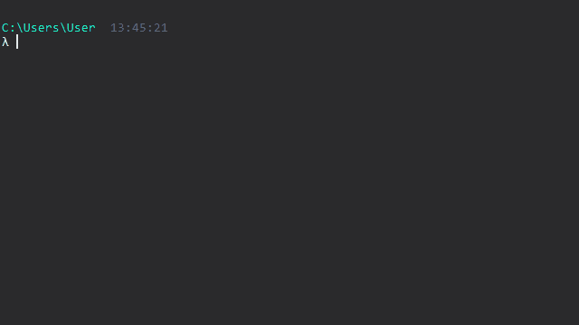
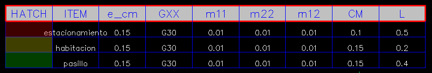
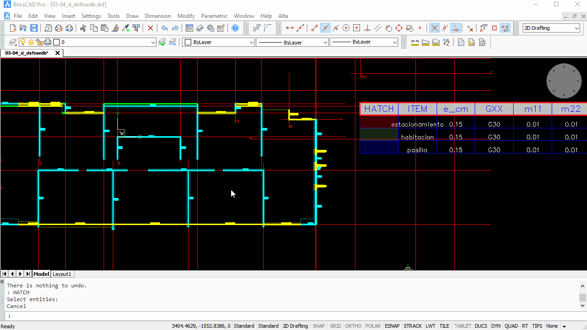
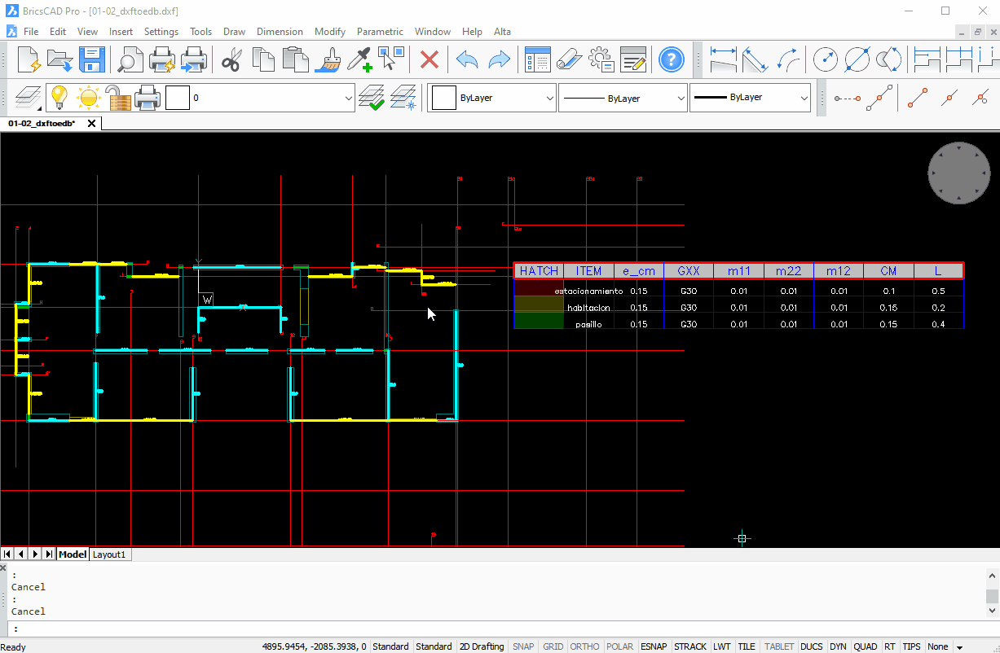

# Dxftoedb3

Dxftoedb3 es el tercer script de la aplicación. Su función inyectar en los planos "../planos_dxftoedb/[nombre_plano]\_dxftoedb.dxf" la tabla de losas y cargas con sus respectivas propiedades.

## Input

1. "../planos_dxftoedb/[nombre_plano]\_dxftoedb.dxf"

## Uso

Se debe ejecutar invocando el comando <code>dxftoedb3</code>

Luego de la ejecución se solicitará al usuario seleccionar la carpeta de trabajo. La carpeta de trabajo es donde está archivo de configuración project_settings.toml.

## Output

El resultado de la ejecución de dxftoedb3 son los planos "../planos_dxftoedb/[nombre_plano]\_dxftoedb.dxf" con las tablas de losas y cargas necesaria para definir las zonas de carga.

!!! warning

    Al editar un plano, se debe guardar en formato **Autocad 2010 ASCI DXF (.dxf)**

    

### Losas y cargas

Las losas y cargas están directamente relacionadas ya que en un mismo procedimiento se agregan tanto las losas como las cargas.

- En el plano correspondiente, el usuario debe identificar las distintas losas existentes y modificar sus propiedades de acuerdo a sus características.
- El usuario debe dibujar elementos tipo "hatch" y asignarle al elemento el color correspondiente de la tabla.

#### Método 1

#### Método 2

