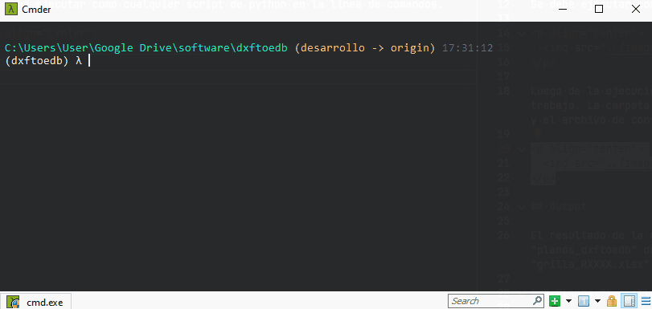

# Dxftoedb3

Dxftoedb3 es el tercer script de la aplicación. Su función es rescatar los datos desde los planos "../planos_dxftoedb/[nombre_plano]\_dxftoedb.dxf" y prepararlos para el último script que generará el modelo Etabs.

## Input

1. "../planos_dxftoedb/[nombre_plano]\_dxftoedb.dxf"

## Uso

Se debe ejecutar invocando el comando <code>dxftoedb3</code>

  

## Output

El resultado de la ejecución de dxftoedb3 es un archivo en formato JSON con los datos rescatados "../[codigo_proyecto].json".

!!! warning

    El archivo JSON puede ser modificado y los cambios se reflejarán en el modelo, sin embargo no tendrá respaldo en planos.

  <a href="../dxftoedb4/" style="display: inline-block; background-color: #EF7701; color: white; padding: 5px 10px; text-decoration: none; border-radius: 5px;">Siguiente: Dxftoedb4</a>

