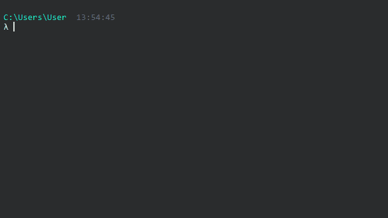

# Dxftoedb4

Dxftoedb4 es el cuarto script de la aplicación. Su función es rescatar los datos desde los planos "../planos_dxftoedb/cargas/[nombre_plano]\_cargas.dxf" y generar el modelo Etabs.

## Input

1. "../planos_dxftoedb/cargas/[nombre_plano]\_cargas.dxf"

## Uso

Se debe ejecutar invocando el comando <code>dxftoedb4</code>

Luego de la ejecución se solicitará al usuario seleccionar la carpeta de trabajo. La carpeta de trabajo es donde está el archivo de configuración project_settings.toml.

## Output

El resultado de la ejecución de dxftoedb4 es un archivo edb "../[codigo_proyecto].edb".
