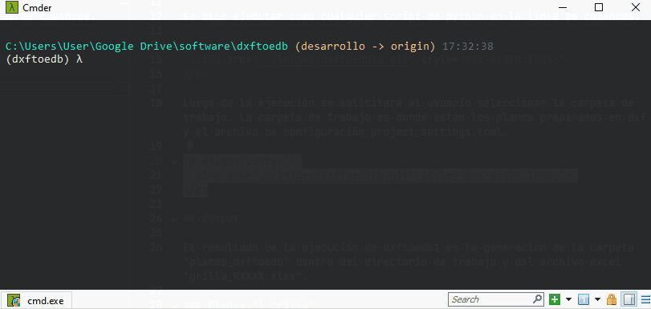

# Dxftoedb4

Dxftoedb4 es el cuarto script de la aplicación. Su función es generar el modelo Etabs.

## Input

1. "../[codigo_proyecto].json"

## ¿Como ejecutar dxftoedb4?

Se debe ejecutar como cualquier script de python en la línea de comandos.

  

## Output

El resultado de la ejecución de dxftoedb4 es un archivo edb "../[codigo_proyecto].edb".

  <a href="../problemas/" style="display: inline-block; background-color: #EF7701; color: white; padding: 5px 10px; text-decoration: none; border-radius: 5px;">Siguiente: Problemas</a>

