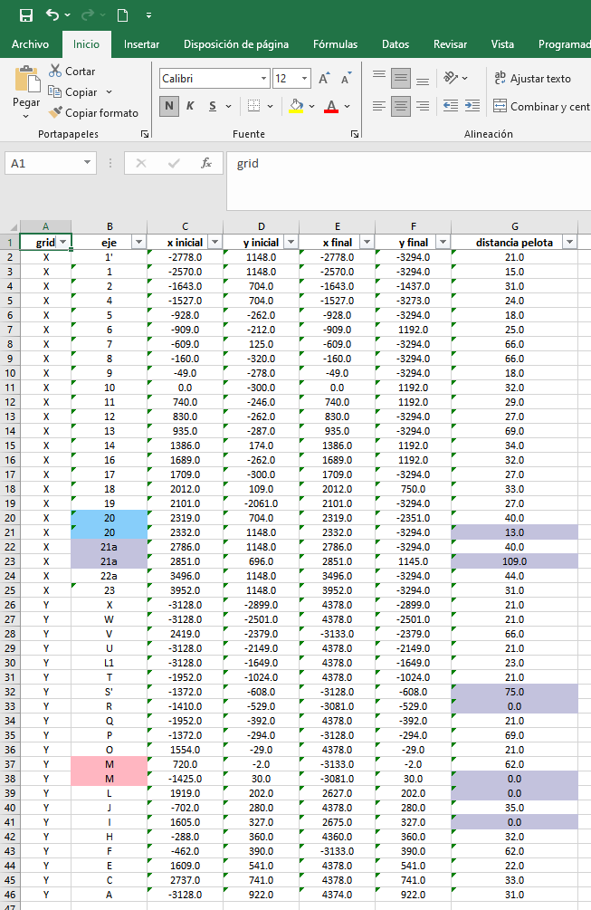

# Excel de coordenadas

El archivo "grilla_RXXXX.xlsx" contiene la información de los ejes que se pudo rescatar.

Los datos vienen ordenados por direccion del eje, ya sea X, Y o Diagonal, y desde la coordenada menor la mayor.

Este archivo DEBE ser revisado por el usuario, en paralelo con los planos "\_grilla", para detectar cualquier inconsistencia que pudiese haber ocurrido en el proceso de captura.

Para facilitar la visualización y la detección de inconsistencias se han incorporado las siguientes caracteristicas:

- Los ejes que han sido detectados con igual nombre y distinta coordenadas están pintados en un mismo color.
- Se ha incorporado una columna "distancia pelota", que representa la distancia encontrada entra el borde de una línea de eje y una pelota de eje. Cuando esta distancia es menor a 15cm o mayor a 70cm, se pintará la celda de color para indicar un eje "sospechoso" que se sugiere revisar.

  

## Problemas con ejes

Dentro de los posibles problemas que se puede encontrar se encuentran los siguientes

### Ejes de nombre duplicado

Solución: Editar la celda correspondiente asignando el nombre correcto al eje mal asignado.

### Eje con nombre incorrecto

Solución: Editar la celda correspondiente asignando el nombre correcto al eje mal asignado.

### Eje no detectado

Solución: Agregar una fila adicional al archivo excel con las coordenadas del eje no detectado (usar distancia pelota = 0).
