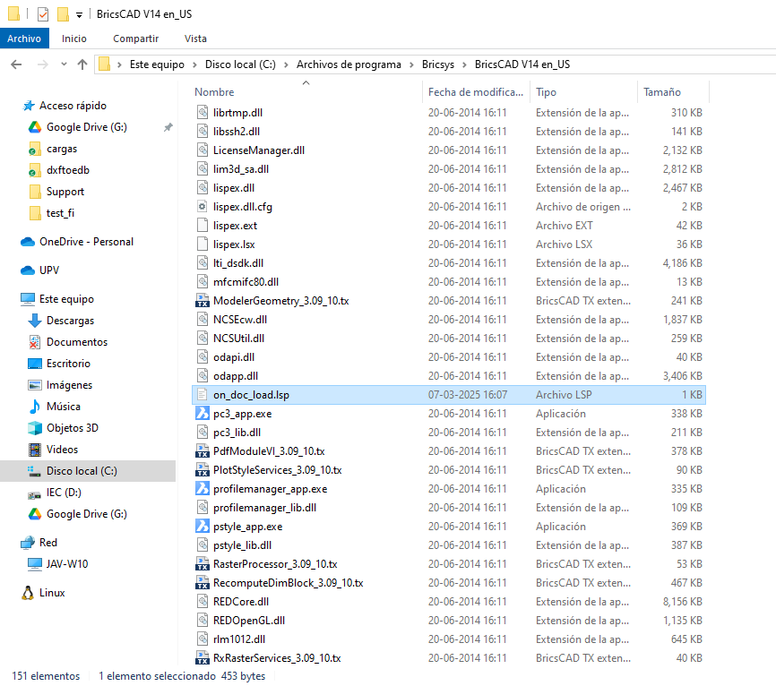
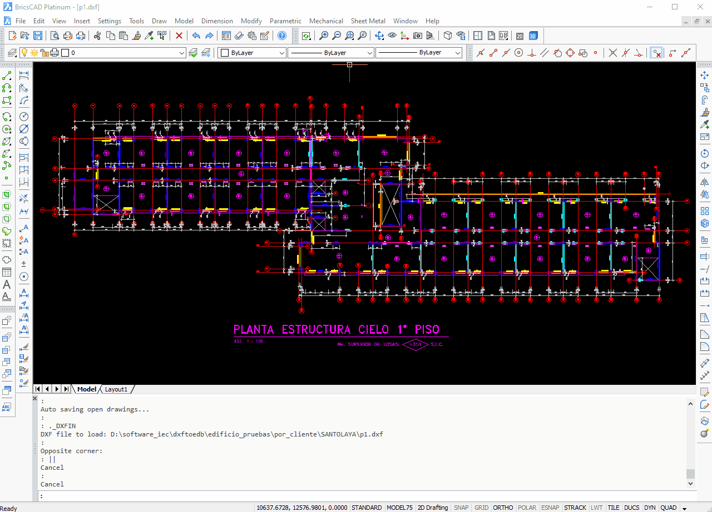
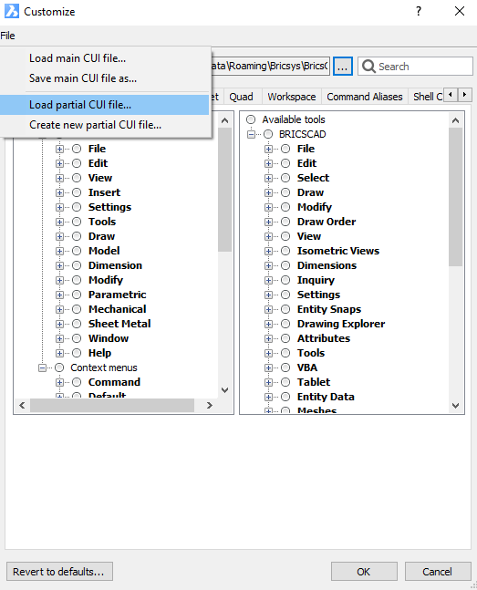

# Instalacion de las herramientas CAD y Menú IEC

---

## Ubicación de Archivos

Para utilizar las herramientas correctamente, es necesario crear una estructura de carpetas específica en la unidad **D:**.

### Estructura de Carpetas
1. En la unidad **D:**, crea una carpeta llamada **bricscad**.
2. Dentro de la carpeta **bricscad**, coloca los archivos de las herramientas:
   - `prelosa.lsp`
   - `motes.lsp`

---

## Copia de Archivo de Inicio

Para garantizar que las herramientas se carguen automáticamente al iniciar **BricsCAD**, es necesario copiar el archivo `on_doc_load.lsp` en la carpeta de instalación del software.

### Pasos para configurar el archivo de inicio
1. Localiza la carpeta donde está instalado **BricsCAD** (por defecto suele estar en `C:\Program Files\Bricsys\BricsCAD <versión>\`).
2. Copia el archivo `on_doc_load.lsp` en la carpeta de instalación.
3. Reinicia **BricsCAD** para aplicar los cambios.

---

## Instalación Menú IEC
### Descripción

El **Menú IEC** reúne un conjunto de herramientas diseñadas para optimizar el proceso **dxftoedb**, facilitando la gestión y edición de planos en **BricsCAD**.

### Procedimiento de instalación

**Abrir la configuración de personalización:**

   - Haz **clic derecho** en la zona de las barras de comandos.
   - Selecciona la opción **Customize...**.

**Cargar el archivo del menú IEC:**

   - En la ventana de personalización, dirígete a la pestaña **File** y haz clic en **Load Partial CUI file...**.

**Seleccionar el archivo de configuración:**

   - Navega hasta la carpeta donde se encuentra el archivo **"IEC.cui"** y selecciónalo.

**Finalizar la instalación:**

   - Haz clic en **Aceptar** para confirmar la carga del menú.
   - ¡Listo! Ahora el **Menú IEC** está disponible en **BricsCAD**.

