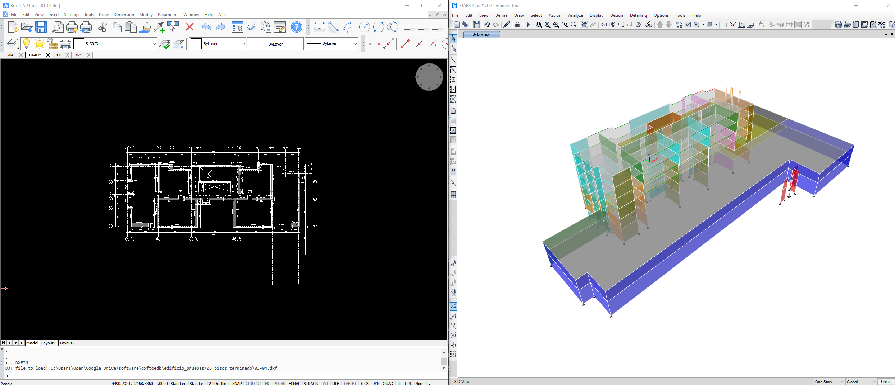

# DXFTOEDB

_Generación automatizada de modelos ETABS a partir de planos en formato DXF_

---

Dxftoedb es una aplicación de línea de comandos para generar automáticamente modelos de Etabs a partir de planos dxf. Las etapas principales del proceso son la limpieza y preparación de los planos, la generación de planos preliminares para el ajuste de los ejes de coordenadas, la detección automática de los elementos estructurales presentes en los planos, el rescate de los elementos estructurales y la generación del modelo en etabs.
