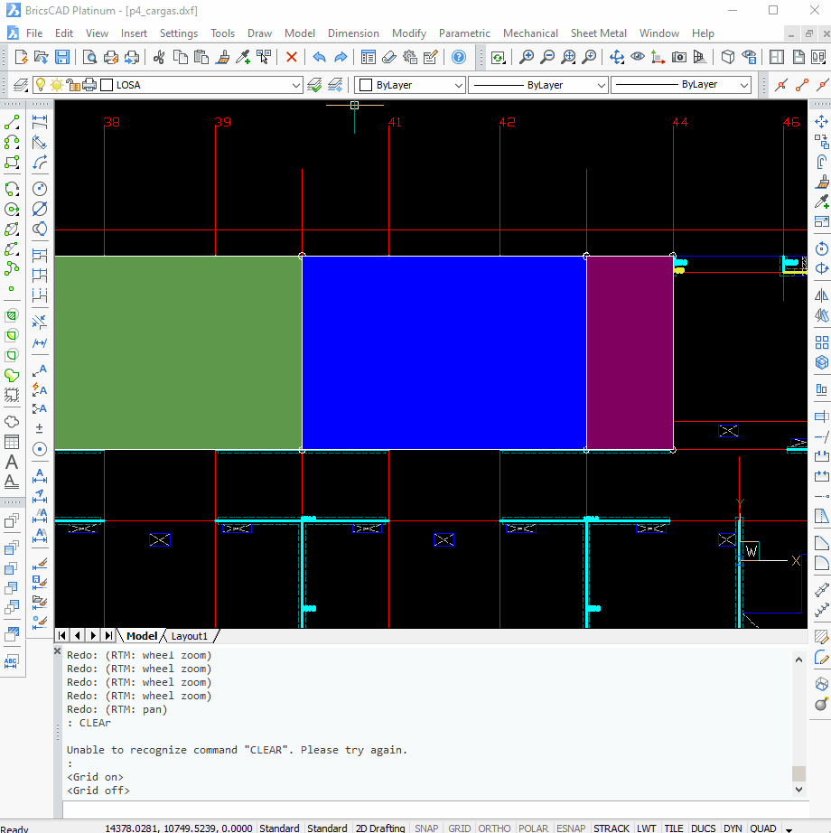

## Descripción
La herramienta **Motes** permite detectar puntos de polilíneas que se encuentran **muy cercanos entre sí** sin tocarse, lo que podría generar problemas en la correcta interpretación del dibujo.

## Funcionamiento
1. **Ejecutar la herramienta** en el entorno CAD.
2. La herramienta analizará todas las **polilíneas** presentes en el dibujo.
3. Se identifican **pares de vértices** de diferentes polilíneas que están dentro de una distancia umbral pero sin conectarse.
4. Los puntos problemáticos serán listados en la consola de AutoLISP.
5. El usuario podrá revisar y corregir las irregularidades detectadas.

## Uso

Se utiliza para verificar que las polilíneas generadas para los hatch en los planos "../planos_dxftoedb/cargas/[nombre_plano]_cargas.dxf" no presenten problemas de precisión. Esto garantiza que, al exportar el archivo a ETABS, no se generen errores en la estructuración del elemento losa ni en los elementos que interactúan con ella.

## Consideraciones
- La distancia umbral para identificar los puntos cercanos puede configurarse en el código fuente de la herramienta.
- Es recomendable ejecutar esta verificación antes de finalizar el dibujo para evitar inconsistencias en los planos.

