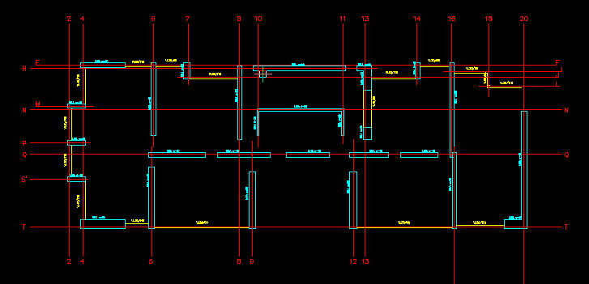

# Planos "\_grilla"

Dentro del directorio "planos_dxftoedb" estará un nuevo set de planos "limpios", los archivos se identifican por el sufijo "\_grilla", este set de planos sirve para comprobar que elementos fueron rescatados y está configurado con las capas adecuadas para ser leído en la siguiente etapa.

