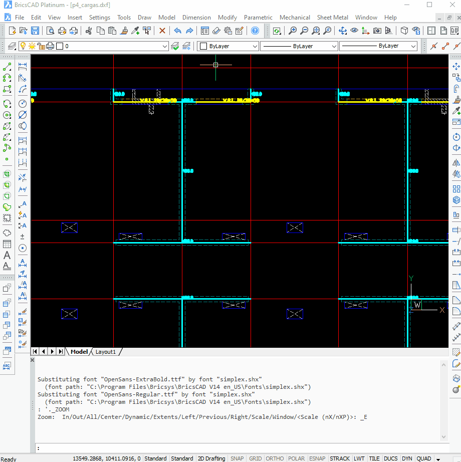

## Descripción
La herramienta **Prelosa** permite generar polilíneas conectando puntos seleccionados en el dibujo. Si la polilínea forma un contorno cerrado, se genera automáticamente un **hatch** en su interior.

## Funcionamiento
1. **Ejecutar la herramienta** en el entorno CAD.
2. **Seleccionar los puntos** que definirán el perímetro de la losa.
3. La herramienta generará una **polilínea** conectando los puntos en orden.
4. Si la polilínea está **cerrada**, se creará un **hatch** dentro de la forma.

## Uso

Se utiliza para crear los hatch necesarios en la definicion de losas en los planos *"../planos_dxftoedb/cargas/[nombre_plano]\_cargas.dxf"*

## Consideraciones
- La herramienta solo genera **hatch** si la polilínea está **cerrada**.
- Es recomendable verificar la precisión de los puntos seleccionados para evitar errores en la generación de la polilínea y el hatch.

