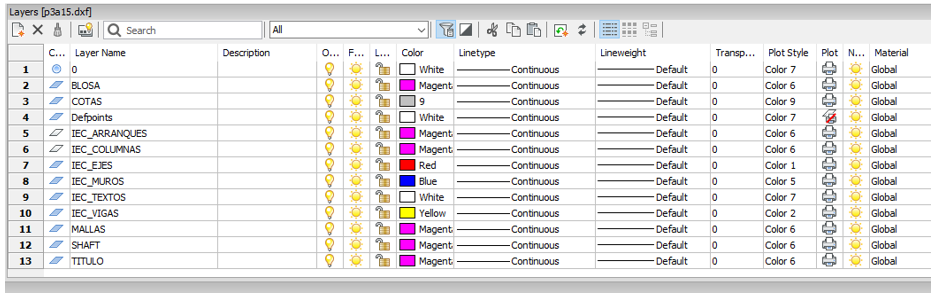

# Prepinchado

## Metodología de Prepinchado para Etabs

- Se reciben los planos en formato DWG.
- Se envían al Ingeniero (a) para que defina los elementos a considerar en el prepinchado
o En épocas de alta demanda cuando no se conoce el ingeniero destinatario, deberá existir un responsable de apoyar el proceso de criterios de pre-pinchado.
- Se insertan todas las plantas en una hoja base de bricscad.
- Se editan o se crean layer y cambiar tipo de líneas a continous, se requiere renombrar solo
  - Ejes →   "_IEC_EJES"
  - líneas de vigas →  "_IEC_VIGAS"
  - líneas de muros → "_IEC_MUROS"
  - Líneas de arranques → "_IEC_ARRANQUES"
  - líneas de columnas → "_IEC_COLUMNAS"

Resto de los layers NO es necesario modificarlos

- Eliminar Layers de Arquitectura, por limpieza.
- Mover las entidades a los layers, resto ignorar y no borrar.
  - líneas de ejes                  → _IEC_EJES
  - Pelotas de ejes                 → _IEC_EJES
  - Textos de ejes                  → _IEC_EJES
  - líneas de vigas                 → _IEC_VIGAS
  - Textos de vigas                 → _IEC_VIGAS
  - líneas de muros                 → _IEC_MUROS
  - Textos de muros                 → _IEC_MUROS
  - líneas de arranques             → _IEC_ARRANQUES
  - Textos de arranques             → _IEC_ARRANQUES
  - Achurado de arranques           → _IEC_ARRANQUES
  - Líneas o polilíneas de columnas → _IEC_COLUMNAS
  - Textos de columnas              → _IEC_COLUMNAS

- Explotar polilíneas y MTEXT, excepto columnas y achurados de arranques.
- Transformar a polilíneas las columnas
- Los elementos deben cumplir con:
- Cada línea de muro o viga define el elemento
- Se requiere un texto x línea en vigas
- El punto de inserción del texto debe ir en el tercio central de la línea
- En muros NO es necesario agregar textos, pero si un muro tiene texto debe ser un texto x línea
- Vigas anchas, deben cortarse frente a los muros
- Muros de espesores variables deben cortarse en los cambios de espesor
- No es necesario cortar las líneas de muros en las intersecciones con otros elementos.
- Mover nombre de ejes a final de línea por el tema de la grilla.
- Eliminar quiebres de ejes y reposicionar el nombre del eje en la línea principal.
- Revisar que todos los elementos (vigas, muros, etc.) tengan ejes y si no es así crear eje y nombrarlo con # + número correlativo, ej.: #1, #2, #3)
- Ejecutar el comando overkill para eliminar duplicados que no se ven (ejecutar tantas veces como sea necesario)
- Se genera una planta aparte con todos los ejes ya sean los existentes más los creados
- Se guardan en forma separada las plantas en formato dxf (AutoCAD 2010 ASCII DXF)
- Estandarizar el nombre de los archivos de planta para pre-pinchar
  - Pisos
    - P01, P02, P10, P21, etc.
  - Subterráneos:
    - S01, S02, S10, etc.
  - Salas de máquina:
    - SM1, SM2, etc
  - Para niveles en cotas especiales:
    - N01, N05, etc

- Incorporar origen de coordenadas consistente entre todos los planos y guardar respetando el formato AutoCAD 2010 ASCII DXF
