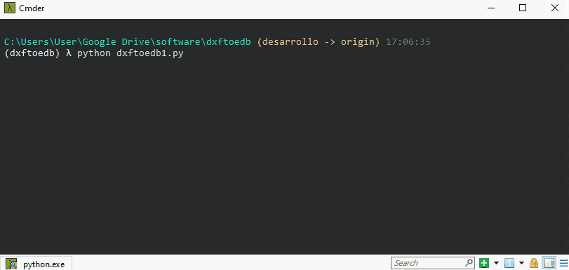

# Dxftoedb1

Dxftoedb1 es el primer script de la aplicación. Su función es leer los planos orignales (después del 'pre-pinchado') y generar un nuevo set de planos 'limpios', solo con los elementos recuperados que pertenecen a las capas indicadas y en las nuevas capas, junto con un archivo excel con las coordenadas de los ejes que se logró recuperar.

## Input

1. Planos pre-pinchados en formato dxf.
2. Archivo de configuración project_settings.toml

## ¿Como ejecutar dxftoedb1?

Se debe ejecutar como cualquier script de python en la línea de comandos.

  

Luego de la ejecución se solicitará al usuario seleccionar la carpeta de trabajo. La carpeta de trabajo es donde están los planos preparados en dxf y el archivo de configuración project_settings.toml.

  

## Output

El resultado de la ejecución de dxftoedb1 es la generación de la carpeta "planos_dxftoedb" dentro del directorio de trabajo y del archivo excel "grilla_RXXXX.xlsx".

### Planos "\_grilla"

Dentro del directorio "planos_dxftoedb" estará un nuevo set de planos "limpios", los archivos se identifican por el sufijo "\_grilla", este set de planos sirve para comprobar que elementos fueron rescatados y está configurado con las capas adecuadas para ser leído en la siguiente etapa.

  

### Excel de coordenadas

El archivo "grilla_RXXXX.xlsx" contiene la información de los ejes que se pudo rescatar.

Los datos vienen ordenados por direccion del eje, ya sea X, Y o Diagonal, y desde la coordenada menor la mayor.

Este archivo DEBE ser revisado por el usuario, en paralelo con los planos "\_grilla", para detectar cualquier inconsistencia que pudiese haber ocurrido en el proceso de captura.

Para facilitar la visualización y la detección de inconsistencias se han incorporado las siguientes caracteristicas:

- Los ejes que han sido detectados con igual nombre y distinta coordenadas están pintados en un mismo color.
- Se ha incorporado una columna "distancia pelota", que representa la distancia encontrada entra el borde de una línea de eje y una pelota de eje. Cuando esta distancia es menor a 15cm o mayor a 70cm, se pintará la celda de color para indicar un eje "sospechoso" que se sugiere revisar.

  

#### Problemas con ejes

Dentro de los posibles problemas que se puede encontrar se encuentran los siguientes:

- Ejes de nombre duplicado. Solución: Editar la celda correspondiente asignando el nombre correcto al eje mal asignado.
- Eje con nombre incorrecto. Solución: Editar la celda correspondiente asignando el nombre correcto al eje mal asignado.
- Eje no detectado. Solución: Agregar una fila adicional al archivo excel con las coordenadas del eje no detectado (usar distancia pelota = 0).
