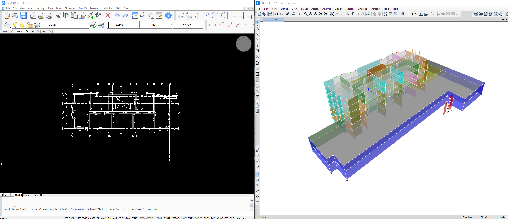

# EDBTOPRE

{: style="display: block; box-shadow: 0 4px 6px rgba(0, 0, 0, 0.1);" }

_Generación de archivos para post procesdores_

---

Edbtopre es una aplicación de línea de comandos para generar los arhivos necesarios para los post procesadores de tensiones, esfuerzos y armaduras. Los datos son extraídos directamente desde los modelos ETABS.
