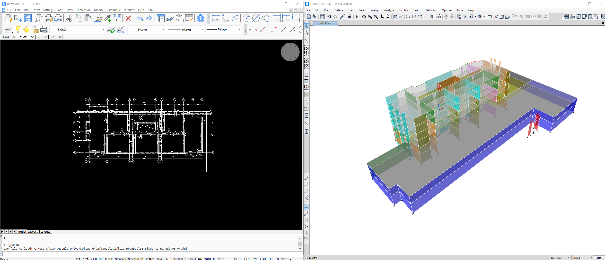

# PRETOVH

{: style="display: block; box-shadow: 0 4px 6px rgba(0, 0, 0, 0.1);" }

_Revisión de tensiones y armaduras de corte_

---

Pretovh es una aplicación de línea de comandos para generar un archivo excel con los esfuerzos en los elementos estructurales, las tensiones y las armaduras de corte requieridas para distintos escenarios.
